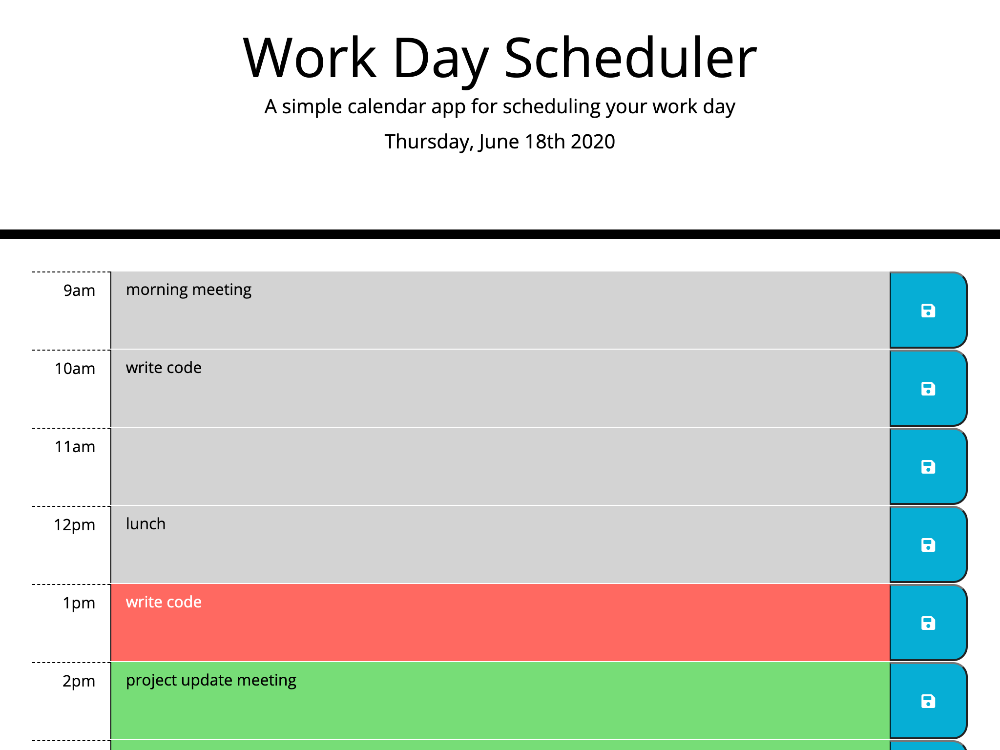

# [Workday](https://thadkingcole.github.io/workday)

A simple calendar application that allows the user to save events for each hour of the day. This app will run in the browser and feature dynamically updated HTML and CSS powered by jQuery.

## Table of Contents

- [Usage](#usage)
- [Dynamic Updates](#dynamic-updates)
- [License](#license)

## Usage

To get started, simply navigate to <https://thadkingcole.github.io/workday>.

To **add** an event...

1. Find the hour you wish to schedule.
1. Click on the text block directly next to the desired hour to activate text entry.
1. Type in the name/description of the event.
1. Click the blue  save button directly next to the text block to save your changes to your browser's local storage.

To **remove** an event...

1. Double-click the event name/description you wish to remove and hit delete/backspace.
1. Click the blue  save button directly next to the text block to save your changes to your browser's local storage.

[back to top](#workday)

## Dynamic Updates

The page will update the following items each time it is loaded.

- Today's date at the top of the page.
- Text area formats according to the current time.
  - Previous hour(s) will be gray. 
  - The current hour will be red. 
  - Upcoming hour(s) will be green. 

[back to top](#workday)

## License

[GPL 3.0](LICENSE)

[back to top](#workday)
